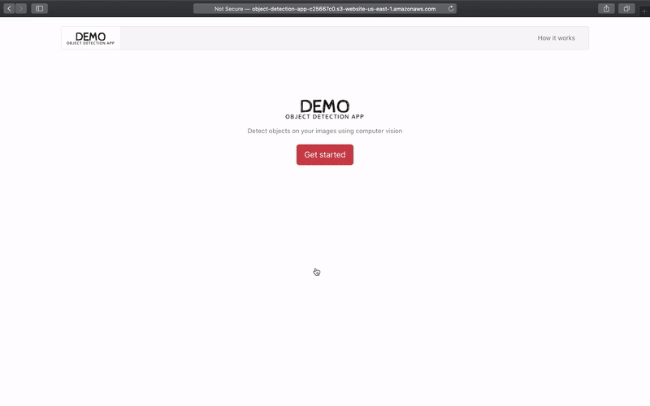
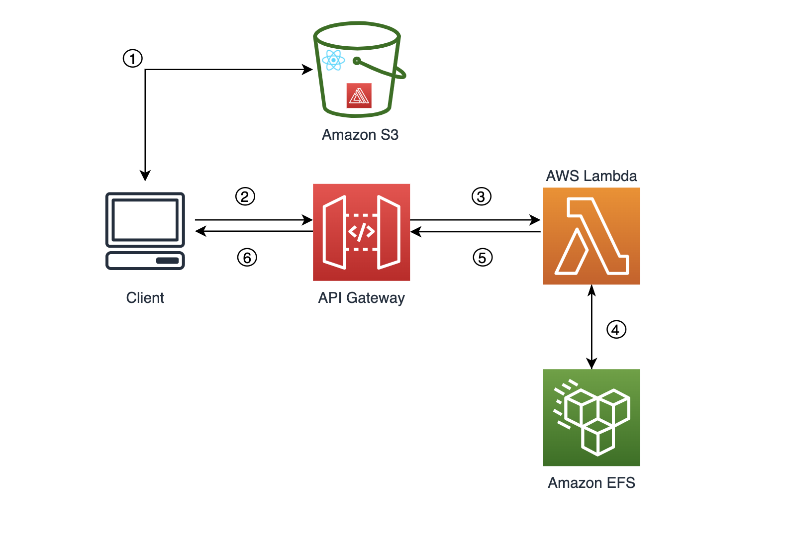
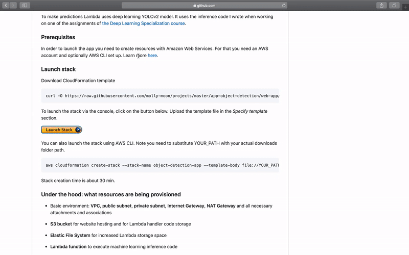

This project is a demo serverless application that performs object detection on uploaded images.  

<p align=center>

</p>

### Start here

You can test the app with a click of a button by creating resources with Amazon Web Services. Check for the prerequisites in the following section.

Or you may edit the CloudFormation template to personalize the app as you wish and then launch it with AWS. Check out the template [here](https://raw.githubusercontent.com/molly-moon/app-object-detection/master/object-detection-app-stack.yml).

### How it works 

The app is a single page website that accepts an input image for back-end serverless processing with AWS Lambda. It responds with the provided input image that has been marked with bouding boxes which represent detected objects. Each bounding box features a label that classifies the detected object.

The front-end was built on top on [Create React App](https://github.com/facebook/create-react-app) open-source project. Both the website and API are hosted on AWS. 

<p align=center>

</p>

The workflow starts with a user request that is handled by AWS Amplify powered by API Gateway. API Gateway is integrated with Lambda function that predicts coordinates of bounding boxes and corresponding labels. Due to considerable volume of machine learning libraries and model weights, all dependencies are stored on Amazon Elastic File System associated with the function.

To make predictions Lambda uses deep learning YOLOv2 model. It uses the inference code I wrote when working on one of the assignments of [the Deep Learning Specialization course](https://www.coursera.org/specializations/deep-learning?utm_source=gg&utm_medium=sem&utm_content=17-DeepLearning-LATAM&campaignid=6516520287&adgroupid=77982690923&device=c&keyword=coursera%20artificial%20intelligence&matchtype=b&network=g&devicemodel=&adpostion=&creativeid=383382632097&hide_mobile_promo&gclid=Cj0KCQjw7ZL6BRCmARIsAH6XFDLvpcCIClw5qxJ8XfolByUM5qkxPaj-3t5GQy92JGu16Hi9_aQgQ6waAjMpEALw_wcB).

### Prerequisites
In order to launch the app you need to create resources with Amazon Web Services. For that you need an AWS account and optionally AWS CLI set up. Learn more [here](https://docs.aws.amazon.com/cli/latest/userguide/cli-configure-quickstart.html).

### Launch stack 

Download CloudFormation template
```
curl -O https://raw.githubusercontent.com/molly-moon/projects/master/app-object-detection/web-app/object-detection-app-stack.yml
```

To launch the stack via the console, click on the button below. Upload the template file in the *Specify template* section. 

[](https://console.aws.amazon.com/cloudformation/home?region=us-east-1#/stacks/new?stackName=object-detection-app) 

You can also launch the stack using AWS CLI. Note you need to substitute YOUR_PATH with your actual downloads folder path.

```
aws cloudformation create-stack --stack-name object-detection-app --template-body file://YOUR_PATH/object-detection-app-stack.yml
```

Stack creation time is about 30 min.

<p align=center>

</p>

### Under the hood: what resources are being provisioned

- Basic environment: **VPC**, **public subnet**, **private subnet**, **Internet Gateway**, **NAT Gateway** and all necessary attachments and associations
- **S3 bucket** for website hosting and for Lambda handler code storage
- **Elastic File System** for increased Lambda storage space
- **Lambda function** to execute machine learning inference code
- **REST API with API Gateway** to serve as a front-door to the application
- **EC2 instance** to perform automated configuration tasks: 
	- Download static files to S3 bucket for website hosting
	- Mount Elastic File System 
    - Download Lambda handler code
	- Download model weights and dependencies

	The instance will self-terminate right after the setup is completed.

### Clean up
- From the console: select the stack to be deleted and then click **Delete** button 
- Using AWS CLI: run the command
````
aws cloudformation delete-stack --stack-name object-detection-app
````

### Acknowledgements
When creating this demo I was inspired by an open-source project [Serverless Stack](https://serverless-stack.com/) by Anomaly Innovations. They created a step-by-step guide to help you build a full-stack serverless application hosted on AWS.

The inference code used to detect object uses [YOLOv2](https://pjreddie.com/darknet/yolov2/), a deep learning model created by Joseph Redmon. The keras implementation of YOLOv2 I use in this project is one of my assignments from [Deep Learning Specialization course](https://www.coursera.org/specializations/deep-learning?utm_source=gg&utm_medium=sem&utm_content=17-DeepLearning-LATAM&campaignid=6516520287&adgroupid=77982690923&device=c&keyword=coursera%20deep%20learning%20ai&matchtype=b&network=g&devicemodel=&adpostion=&creativeid=383382632097&hide_mobile_promo&gclid=CjwKCAjwkJj6BRA-EiwA0ZVPVg2MCerBH5g0Hh03wK0ESxG68Ty0ulraJbtGfk9VcnZs95aaIdgyrRoCLY4QAvD_BwE) created by deeplearning.ai. The course assignment was greatly inspired by [Yet Another Darknet 2 Keras project](https://github.com/allanzelener/YAD2K) by Allan Zelener.